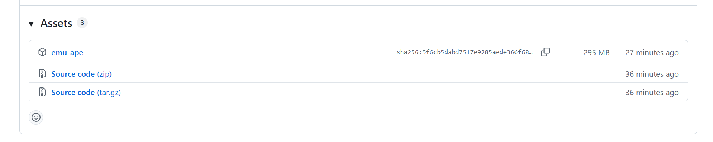
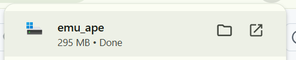
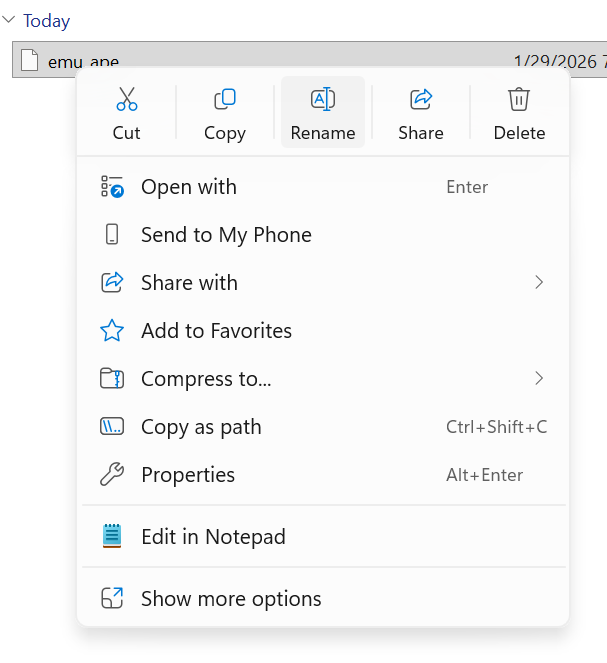
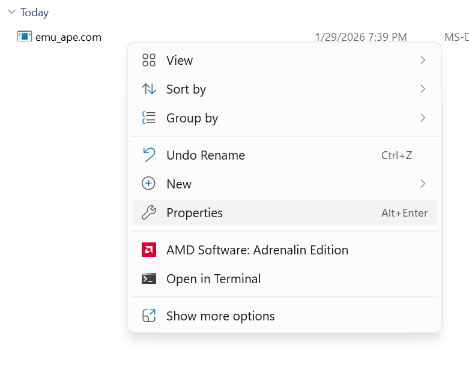
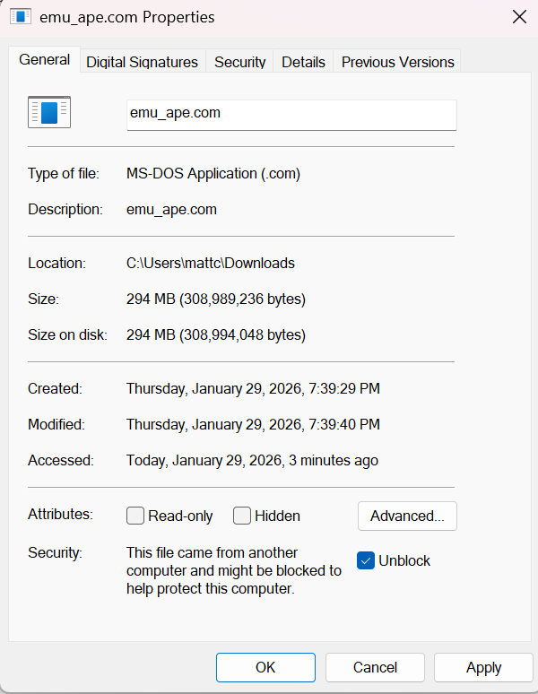

# emu_ape

A self-contained emulator server built as an [Actually Portable Executable](https://justine.lol/ape.html). Run a single binary on any OS and get a browser-based retro game emulator -- no dependencies, no installation.

The server embeds [EmulatorJS](https://github.com/EmulatorJS/EmulatorJS) and all its cores directly inside the APE binary using Cosmopolitan's zip filesystem. Drop ROM files into a `roms/` folder and they appear in the web UI automatically.

## Installation (Windows)

### 1. Download

Go to the [releases page](https://github.com/MattCruikshank/emu_ape/releases) and download the `emu_ape` file.



### 2. Open the download folder

Open the folder where the file was downloaded.



### 3. Rename

Rename `emu_ape` to `emu_ape.com` so Windows can run it as an executable.



### 4. Properties

Right-click the file and select **Properties**.



### 5. Unblock

At the bottom of the **General** tab, check **Unblock** and click **Apply**. Windows blocks files downloaded from the internet by default.



### 6. Run

Double-click `emu_ape.com` to start the server. Open http://localhost:6711 in your browser.

## Building from source

Requires [Cosmopolitan](https://github.com/jart/cosmopolitan) (`fatcosmocc` and `zip`) and `7z`.

```
make
```

This will automatically download EmulatorJS v4.2.3, compile the server, and embed all assets into the binary.

```
make run
```

## Acknowledgments

Many thanks to the [EmulatorJS](https://github.com/EmulatorJS/EmulatorJS) project for providing a fantastic browser-based emulation platform. This project would not be possible without their work packaging RetroArch cores for the web.
